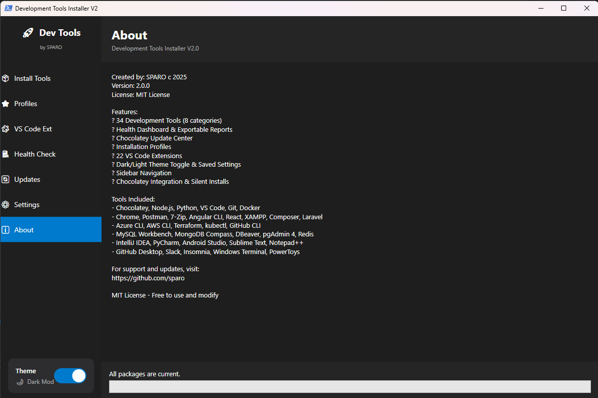
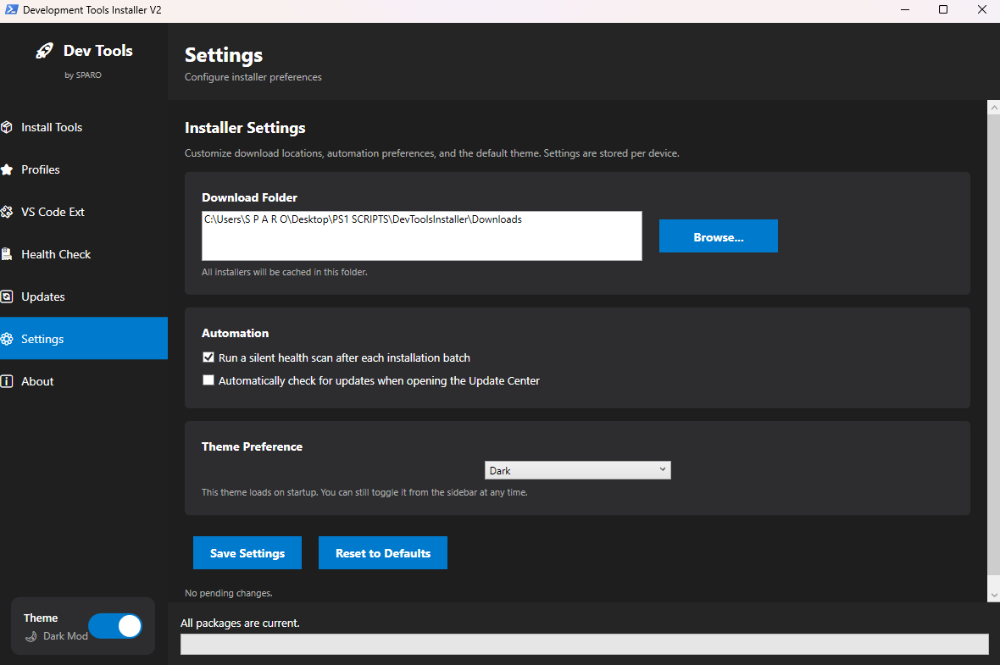
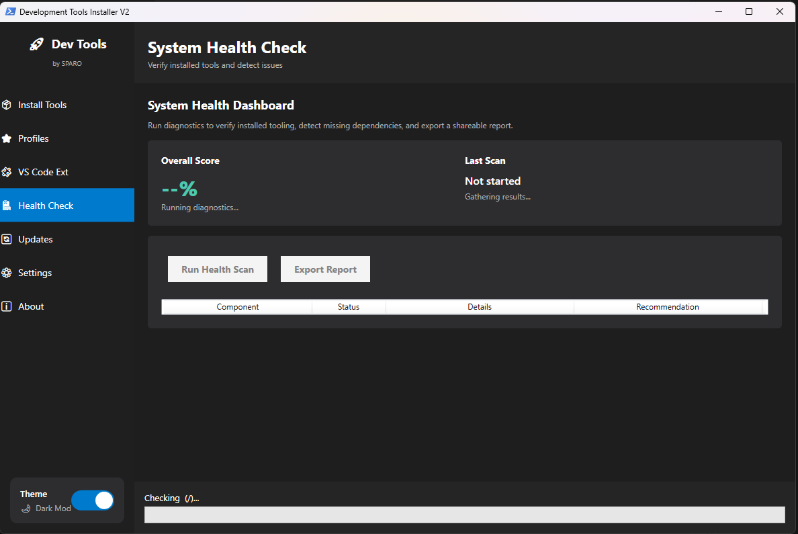
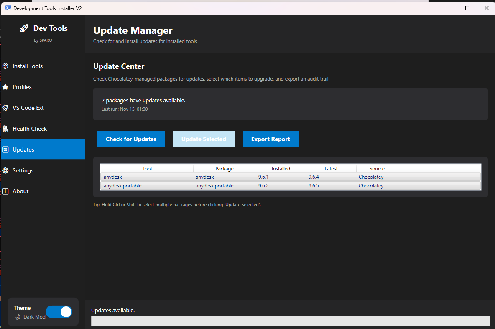
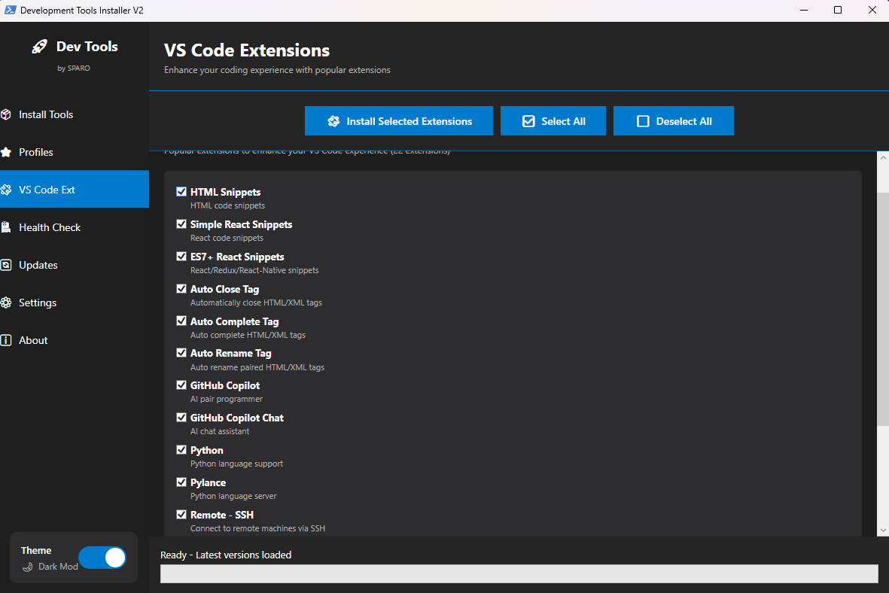

# Development Tools Installer 2.0

Modern PowerShell + WPF desktop experience for provisioning a complete development workstation in minutes. Crafted with ❤️ by [SPARO](https://github.com/sparo).



## Highlights

- 🧭 Sidebar navigation with profiles, VS Code extensions, health dashboard, update center, and saved settings.
- 🛠️ 30+ developer tools and 20+ curated VS Code extensions install via Chocolatey.
- 🩺 Real-time health checks, JSON export, and automatic post-install scans.
- 🎨 Dark/Light themes, persistent settings, and download path management.
- 📊 Update manager for tracking and upgrading installed Chocolatey packages.

## Project Structure

```
DevToolsInstaller/
├── assets/
│   └── images/           # Screenshots used in docs/README
├── docs/
│   ├── ARCHITECTURE.md   # Deep dive into UI + module design
│   ├── QUICK_GUIDE.md    # Feature overview
│   └── UPDATES.md        # Release notes
├── src/
│   ├── DevToolsInstaller.ps1  # Main WPF application
│   ├── Modules/               # VersionFetcher / Installer / Configuration / VSCodeExtensions
│   ├── Downloads/             # Cached installers (auto-created)
│   └── Logs/                  # Health + install/export logs
├── LAUNCH.ps1                 # Root-level admin wrapper
└── README.md, LICENSE.md
```

## Requirements

- Windows 10/11 with PowerShell 5.1+ (Windows PowerShell) or PowerShell 7+
- Administrator privileges (required for Chocolatey + software installs)
- Internet access to download installers and VS Code extensions

## Quick Start

1. **Clone**
   ```powershell
   git clone https://github.com/your-account/DevToolsInstaller.git
   cd DevToolsInstaller
   ```
2. **Launch**
   ```powershell
   pwsh -ExecutionPolicy Bypass -File .\LAUNCH.ps1
   ```
3. **Pick tools**
   - Use the **Tools** tab for single installs or profile bundles.
   - Visit **Extensions** to queue VS Code extension packs.
4. **Install / monitor**
   - Action bar shows live status; logs saved under `src\Logs`.
   - Optional health check runs automatically post-install.

## Settings & Personalization



- Choose default download directory (handy for portable drives).
- Toggle auto health scan + update check per install session.
- Persist Dark/Light theme preference.
- Settings are stored in `src\user-settings.json`.

## Health Dashboard



- Runs dependency tests for admin elevation, runtimes, CLIs, and PATH entries.
- Exports JSON report for audits with a single click.
- Silent mode runs automatically when configured.

## Update Center



- Detects outdated Chocolatey packages.
- Bulk update workflow with real-time status and log capture.

## VS Code Extensions



- Curated list of frontend, backend, DevOps, and productivity extensions.
- Group install with progress reporting and completion summary.

## Development Notes

- Main PowerShell entry point uses modules under `src/Modules` to keep UI, install orchestration, and extension logic isolated.
- New screenshots live in `assets/images` to keep root tidy.
- Additional reference docs live in `docs/`; feel free to expand for blog posts or wiki content.

## Credits

Built and maintained by **SPARO** — contributions welcome! Open issues or PRs for new tool requests, bug fixes, or UI polish. Tag `@sparo` on pull requests to get attention quickly.
# DevToolsInstaller
